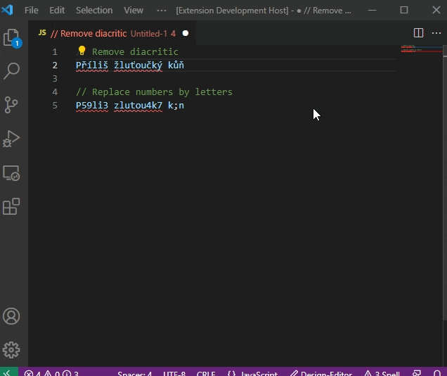

# CZDiac README

This is simple extension for working with Czech text with our without diactitic.
So far it contain two functions which are described in the section bellow

## Features

- `Remove diacritic` - This will replaces all letters with Czech diacritic to letters without
- `Convert numbers to letters with diacritic` - This will replace all numbers with lowercase letters with Czech diacritic

See the animation below

## Requirements

None

## Release Notes

### 1.0.1

Initial release of the extension